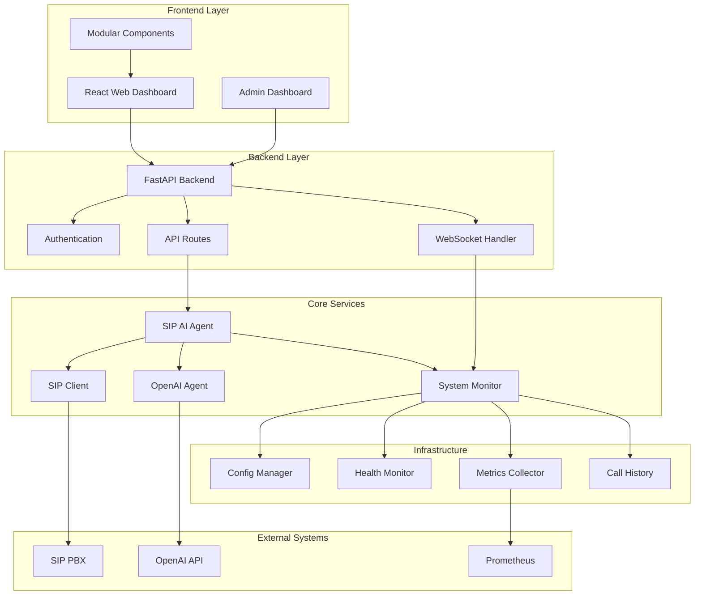

[](https://www.gnu.org/licenses/gpl-3.0)
[](https://github.com/vaheed/sip-ai-agent/actions)
[](https://codecov.io/gh/vaheed/sip-ai-agent)
[](https://www.python.org/downloads/)

# SIP AI Agent - Enterprise Voice Assistant Platform

## Overview

This repository contains a comprehensive Python application that registers as a SIP extension
on your PBX and connects callers to an OpenAI voice assistant with enterprise-grade
reliability, observability, performance, and a modern web-based management interface. 
It supports both the legacy `/v1/audio/speech` WebSocket API and the newer realtime API 
for ultra‑low‑latency speech‑to‑speech interactions.

### 🚀 Key Features

- **🔄 SIP Stack Hardening**: Automatic reconnection, backoff strategies, NAT traversal (STUN/TURN/ICE)
- **🎵 Enhanced Audio Pipeline**: 16-bit PCM @ 16kHz with backpressure handling and graceful shutdown
- **🤖 OpenAI Integration**: Full realtime API support with session configuration and voice validation
- **📊 Comprehensive Observability**: Structured logging, correlation IDs, Prometheus metrics, health checks
- **🌐 Modern Web Dashboard**: FastAPI backend with React frontend for real-time monitoring and management
- **📞 Call History & Analytics**: Complete call tracking with CSV export and performance analytics
- **⚙️ Configuration Management**: Web-based configuration editor with live reload capabilities
- **🔐 Authentication & Security**: Session-based auth, SRTP encryption, secure defaults, security scanning
- **🐳 Production Ready**: Docker containerization, CI/CD pipelines, automated testing, quality gates
- **🎨 UI/UX Quality System**: ESLint, Stylelint, accessibility testing, visual regression, Lighthouse CI

### 🌟 Enhanced Features

* **Robust SIP Client**: PJSIP-based with automatic reconnection, NAT traversal, SRTP encryption
* **Advanced Audio Processing**: 16-bit PCM @ 16kHz with backpressure handling and dropout detection
* **OpenAI Realtime API**: Full support with session configuration, voice validation, and token tracking
* **Enterprise Monitoring**: Structured JSON logging, correlation IDs, Prometheus metrics, health checks
* **Web Management Interface**: Real-time dashboard, call history, configuration editor, system monitoring
* **Call Analytics**: Comprehensive call tracking, statistics, CSV export, audio quality metrics
* **Production Deployment**: Docker support, health checks, graceful shutdown, security scanning
* **Developer Experience**: Typed configuration, comprehensive testing, pre-commit hooks, CI/CD pipeline
* **Quality Assurance**: Automated UI/UX testing, accessibility compliance, performance monitoring

## 🏗️ Architecture

The SIP AI Agent follows a modular architecture with clear separation of concerns:



### 📁 Project Structure

```
sip-ai-agent/
├── app/                          # Backend Application
│   ├── agent.py                  # Main application controller
│   ├── sip_client.py             # SIP protocol handling
│   ├── openai_agent.py           # OpenAI API integration
│   ├── config.py                 # Configuration management
│   ├── logging_config.py         # Structured logging
│   ├── auth.py                   # Authentication & sessions
│   ├── api_routes.py             # REST API endpoints
│   ├── websocket_handler.py      # WebSocket connections
│   ├── config_manager.py         # Configuration file management
│   ├── system_monitor.py         # System monitoring
│   ├── monitor.py                # Monitoring coordinator
│   ├── web_backend.py            # FastAPI application
│   ├── health.py                 # Health monitoring
│   ├── metrics.py                # Prometheus metrics
│   ├── call_history.py           # Call tracking & analytics
│   └── start_web_ui.py           # Web UI startup
├── web/                          # Frontend Application
│   ├── index.html                # Main React application
│   ├── js/components/            # Modular React components
│   │   ├── admin/                # Admin dashboard components
│   │   │   ├── metrics-cards.js  # Key metrics display
│   │   │   ├── system-health.js  # System health overview
│   │   │   ├── charts-analytics.js # Charts and analytics
│   │   │   └── activity-alerts.js # Activity and alerts
│   │   ├── admin-dashboard.js    # Main admin dashboard
│   │   ├── call-history.js       # Call history component
│   │   ├── logs-viewer.js        # Logs viewer component
│   │   ├── configuration.js      # Configuration component
│   │   ├── statistics.js         # Statistics component
│   │   └── common.js             # Shared utilities
│   ├── tests/e2e/               # End-to-end tests
│   └── package.json              # Frontend dependencies
├── tests/                        # Backend Tests
│   ├── test_auth.py             # Authentication tests
│   ├── test_config_manager.py   # Config management tests
│   ├── test_system_monitor.py   # System monitoring tests
│   ├── test_web_backend.py      # Web backend tests
│   └── test_web_backend_extended.py # Extended backend tests
├── scripts/                      # Utility Scripts
├── docker-compose.yml            # Development environment
├── docker-compose.prod.yml       # Production environment
├── Dockerfile                    # Application container
├── Dockerfile.web                # Web UI container
├── env.example                   # Configuration template
├── requirements.txt              # Python dependencies
└── README.md                     # This file
```

### 🔧 Component Overview

#### Core SIP Components
- **`agent.py`** - Main application controller and orchestrator
- **`sip_client.py`** - SIP protocol handling and call management
- **`openai_agent.py`** - OpenAI API integration and audio processing
- **`config.py`** - Configuration management with Pydantic
- **`logging_config.py`** - Structured logging with correlation IDs

#### Authentication & Security
- **`auth.py`** - Authentication, session management, and security
- **`api_routes.py`** - REST API endpoints with proper authentication
- **`websocket_handler.py`** - WebSocket connections and real-time updates

#### Monitoring & Analytics
- **`health.py`** - System health monitoring and diagnostics
- **`metrics.py`** - Prometheus metrics collection
- **`system_monitor.py`** - System monitoring and health checks
- **`monitor.py`** - Monitoring coordinator and orchestration
- **`call_history.py`** - Call tracking, analytics, and persistence
- **`config_manager.py`** - Configuration file management

#### Web Interface
- **`web_backend.py`** - FastAPI REST API and WebSocket server
- **`start_web_ui.py`** - Web UI startup and orchestration
- **`web/index.html`** - React-based frontend dashboard
- **`web/js/components/`** - Modular React components for better maintainability

#### Development & Quality
- **`demo_calls.py`** - Demo data generation for testing
- **`scripts/version.py`** - Semantic versioning and release management
- **`scripts/deploy.sh`** - Deployment automation
- **`.github/workflows/`** - CI/CD pipelines for Docker and UI/UX quality

## Requirements

* **PBX System**: Asterisk-based PBX (FreePBX or VICIdial) with an extension configured
* **OpenAI API**: API key with access to the `gpt-realtime` model for realtime mode
* **Network**: Proper firewall configuration for SIP (5060/udp) and RTP (16000-16100/udp) ports
* **System**: Docker and Docker Compose, or Python 3.9+ for direct installation

## Installation

1. **Clone the repository**

   ```bash
   git clone https://github.com/vaheed/sip-ai-agent.git
   cd sip-ai-agent
   ```

2. **Configure the environment**

   Copy `env.example` to `.env` and edit it with your configuration:

   ```bash
   cp env.example .env
   # Edit .env with your settings
   ```

   **Required Configuration:**
   ```env
   # SIP Configuration (Required)
   SIP_DOMAIN=pbx.example.com
   SIP_USER=1001
   SIP_PASS=secret

   # OpenAI Configuration (Required)
   OPENAI_API_KEY=sk-your-openai-api-key
   AGENT_ID=va_123456789
   ```

   **Advanced Configuration Options:**
   ```env
   # SIP Advanced Features
   SIP_SRTP_ENABLED=true
   SIP_NAT_TYPE=STUN
   SIP_STUN_SERVER=stun.l.google.com:19302
   SIP_JITTER_BUFFER_SIZE=80

   # Audio Pipeline
   AUDIO_SAMPLE_RATE=16000
   AUDIO_BACKPRESSURE_THRESHOLD=100

   # Observability
   METRICS_ENABLED=true
   STRUCTURED_LOGGING=true
   DEBUG=false
   ```

   See `env.example` for a comprehensive list of all available configuration options.

3. **Deploy with Docker Compose**

   #### Option A: Development (Local Build)
   ```bash
   docker compose up --build
   ```

   #### Option B: Production (Using GitHub Container Registry)
   ```bash
   docker compose -f docker-compose.prod.yml up -d
   ```

   This starts the SIP agent and web dashboard:
   - **Web Dashboard**: `http://localhost:8080` (Login: admin/admin123)
   - **Health Checks**: `http://localhost:8080/healthz`
   - **Prometheus Metrics**: `http://localhost:9090/metrics`
   - **SIP Signaling**: `5060/udp`
   - **RTP Media**: `16000-16100/udp`

4. **Verify deployment**

   ```bash
   # Check container health
   docker compose ps
   
   # View logs
   docker compose logs -f
   
   # Test health endpoint
   curl http://localhost:8080/healthz
   ```

5. **Access the web dashboard**

   Open your browser to `http://localhost:8080` and login with:
   - **Username**: `admin`
   - **Password**: `admin123`

   ⚠️ **Important**: Change these default credentials in production!

   The dashboard provides comprehensive monitoring and management capabilities.

## 🚀 Quick Production Deployment

For production deployment using pre-built Docker images from GitHub Container Registry:

```bash
# 1. Clone the repository
git clone https://github.com/vaheed/sip-ai-agent.git
cd sip-ai-agent

# 2. Configure environment
cp env.example .env
# Edit .env with your SIP and OpenAI credentials

# 3. Deploy with production Docker Compose
docker compose -f docker-compose.prod.yml up -d

# 4. Access the dashboard
# Open http://localhost:8080
# Login: admin / admin123
```

**Default Credentials:**
- **Username**: `admin`
- **Password**: `admin123`

**Required Configuration:**
```env
SIP_DOMAIN=your-sip-domain.com
SIP_USER=your-sip-username
SIP_PASS=your-sip-password
OPENAI_API_KEY=your-openai-api-key
AGENT_ID=your-agent-id
```

For detailed deployment instructions, see [DEPLOYMENT.md](DEPLOYMENT.md).

## 🌐 Web Dashboard

The modern web dashboard provides a comprehensive interface for monitoring and managing the SIP AI Agent:

### 🎯 Dashboard Features

#### **Overview Tab**
- **Live Status**: SIP registration status, active calls, system uptime
- **Real-time Metrics**: API token usage, call statistics, performance data
- **Quick Actions**: Start/stop services, view logs, access configuration

#### **Admin Dashboard Tab** 🆕
- **System Metrics**: CPU, memory, disk usage with real-time charts
- **Call Analytics**: Success rates, duration trends, cost analysis
- **Resource Monitoring**: Network stats, process information, system health
- **Visual Charts**: Bar charts, pie charts, and trend graphs
- **Activity Feed**: Recent system events and alerts
- **Performance Metrics**: Response times, throughput, error rates

#### **Call History Tab**
- **Complete Call Log**: All calls with timestamps, duration, status
- **Advanced Filtering**: Filter by date, status, duration, tokens used
- **CSV Export**: Download call history for external analysis
- **Search Functionality**: Find specific calls quickly
- **Statistics Summary**: Total calls, success rates, average duration

#### **Logs Viewer Tab**
- **Real-time Logs**: Live log streaming with WebSocket updates
- **Log Levels**: Filter by INFO, WARNING, ERROR, DEBUG
- **Search & Filter**: Find specific log entries quickly
- **Auto-scroll**: Automatically follow new log entries
- **Export Options**: Download logs for analysis

#### **Configuration Tab**
- **SIP Settings**: Domain, user, password, SRTP, NAT traversal
- **OpenAI Settings**: API key, mode, model, voice, temperature
- **Audio Settings**: Sample rate, channels, frame duration
- **System Settings**: Monitoring, logging, security options
- **Live Validation**: Real-time configuration validation
- **Safe Reload**: Apply changes without restart

#### **Statistics Tab**
- **Call Analytics**: Detailed statistics and trends
- **Performance Metrics**: Response times, success rates
- **Token Usage**: OpenAI API consumption and costs
- **System Performance**: Resource usage, uptime, health

### 🎨 UI/UX Features

- **Dark/Light Theme**: Toggle between themes with persistence
- **Responsive Design**: Works on desktop, tablet, and mobile devices
- **Real-time Updates**: WebSocket-powered live updates for all metrics
- **Intuitive Navigation**: Easy-to-use interface with clear information hierarchy
- **Error Handling**: Comprehensive error boundaries and user feedback
- **Loading States**: Smooth loading indicators and skeleton screens

## FreePBX Integration

Follow these steps to connect the agent to FreePBX:

1. **Create a PJSIP extension** matching your `SIP_USER` and `SIP_PASS`.
   Navigate to **Applications → Extensions** in the FreePBX GUI, choose
   “PJSIP” and configure the extension number and secret.  Disable voicemail
   if you don’t want unanswered calls to go to voicemail.
2. **Open media ports** by allowing UDP ports 16000–16100 on your firewall.
   These ports carry the RTP audio and must reach the Docker host.
3. **Add a dialplan entry** so callers can reach the AI assistant.  Edit
   `/etc/asterisk/extensions_custom.conf` and add:

   ```asterisk
   [from-internal-custom]
   exten => 5000,1,NoOp(Call AI assistant)
     same => n,Dial(PJSIP/${SIP_USER}@${SIP_DOMAIN},60)
     same => n,Hangup()
   ```

   Reload the dialplan (e.g. `fwconsole reload`) and dial **5000** from any
   internal phone to talk to the AI assistant.

## VICIdial Integration

VICIdial uses the underlying Asterisk dialplan, so integration is similar:

1. **Define a new in‑group or campaign** that dials an extension such as
   `5000`.  This will be the number that transfers calls to the agent.
2. **Add a custom dialplan entry** in `/etc/asterisk/extensions.conf` within
   the `[default]` or appropriate context:

   ```asterisk
   exten => 5000,1,NoOp(Call AI assistant)
     same => n,Dial(PJSIP/${SIP_USER}@${SIP_DOMAIN},60)
     same => n,Hangup()
   ```

3. **Assign the campaign** to dial this extension.  When VICIdial places an
   outbound call it will transfer the caller to the OpenAI voice assistant.

Alternatively, VICIdial agents can manually dial the agent’s SIP extension
from the agent interface.  Because the agent registers as a normal SIP
extension, any device on the PBX (softphone, hardphone or dialer) can reach
it using the configured extension number.

## 🧪 Testing

### Backend Testing

The project includes comprehensive backend testing:

```bash
# Run all backend tests
python3 -m pytest tests/ -v

# Run specific test modules
python3 -m pytest tests/test_auth.py -v
python3 -m pytest tests/test_config_manager.py -v
python3 -m pytest tests/test_system_monitor.py -v
python3 -m pytest tests/test_web_backend.py -v

# Run with coverage
python3 -m pytest tests/ --cov=app --cov-report=html
```

### Frontend Testing

```bash
# Run E2E tests
cd web
npm run test:e2e

# Run accessibility tests
npm run test:a11y

# Run Lighthouse performance tests
npm run test:lighthouse
```

### Test Coverage

- **Backend**: 76+ tests covering all modules
- **Frontend**: E2E tests for all major components
- **Authentication**: Comprehensive auth flow testing
- **Configuration**: Config management and validation
- **System Monitoring**: Health checks and metrics
- **API Endpoints**: All REST API endpoints tested

## 🔧 Development

### Local Development Setup

```bash
# Clone and setup
git clone https://github.com/vaheed/sip-ai-agent.git
cd sip-ai-agent

# Setup development environment
make setup-dev

# Run tests
make test

# Format code
make format

# Run all quality checks
make check-all
```

### Development Commands

```bash
# Install dependencies
make install-dev

# Run tests with coverage
make test-cov

# Lint and type check
make lint
make typecheck

# Security scan
make security

# Validate configuration
make validate-config

# Run development server
make dev

# Check health
make health

# Web UI development
make web-ui          # Start web UI development server
make web-demo        # Start with demo calls
make web-build       # Build web UI container
make ui-lint         # Run UI/UX linting (ESLint + Stylelint)
make ui-test         # Run UI/UX tests (unit + E2E)
make ui-accessibility # Run accessibility tests
make ui-lighthouse   # Run Lighthouse performance tests
make ui-storybook    # Build and validate Storybook
make ui-quality      # Run all UI/UX quality checks

# Version management
make version         # Show current version
make version-bump-patch  # Bump patch version
make version-bump-minor  # Bump minor version
make version-bump-major  # Bump major version
make version-tag     # Create git tag for current version
make release         # Create release with changelog

# Deployment
make deploy          # Deploy to production
make deploy-staging  # Deploy to staging
make deploy-status   # Check deployment status
make deploy-logs     # View deployment logs
```

### Code Quality

This project uses comprehensive quality assurance tools:

#### Python Quality
- **Black** for code formatting
- **isort** for import sorting
- **flake8** for linting
- **mypy** for type checking
- **pytest** for testing
- **pre-commit** for git hooks
- **bandit** and **safety** for security scanning

#### UI/UX Quality System
- **ESLint** with React/TypeScript rules and naming conventions
- **Stylelint** with BEM/utility policies and design token validation
- **Playwright** for E2E testing, visual regression, and accessibility
- **Vitest** for unit and interaction testing
- **Storybook** for component documentation and testing
- **Lighthouse CI** for performance, SEO, PWA, and accessibility scores
- **pa11y** and **axe-core** for automated accessibility testing
- **Percy** for visual regression testing (optional)

#### Design System
- **Design Tokens** with JSON schema validation
- **Component Library** with Storybook documentation
- **Accessibility Compliance** with WCAG 2.1 AA standards
- **Performance Monitoring** with Lighthouse CI score gates

## 🚀 CI/CD & Deployment

The project includes comprehensive CI/CD pipelines for automated testing, building, and deployment:

### GitHub Actions Workflows

#### 🐳 Docker Deployment Pipeline
- **Multi-platform builds** (linux/amd64, linux/arm64)
- **Automated versioning** with semantic versioning
- **Security scanning** with Trivy vulnerability scanner
- **Registry publishing** to GitHub Container Registry
- **Branch-based tagging** for development and production releases

#### 🎨 UI/UX Quality Pipeline
- **Code style validation** with ESLint and Stylelint
- **Design token validation** with JSON schema checking
- **Accessibility testing** with axe-core and pa11y
- **Visual regression testing** with Playwright screenshots
- **Performance testing** with Lighthouse CI
- **Component testing** with Storybook build validation

### 🏷️ Version Management

The project uses semantic versioning with automated release management:

```bash
# Version management commands
make version                    # Show current version
make version-bump-patch         # Bump patch version (1.0.0 → 1.0.1)
make version-bump-minor         # Bump minor version (1.0.0 → 1.1.0)
make version-bump-major         # Bump major version (1.0.0 → 2.0.0)
make version-tag                # Create git tag for current version
make release                    # Create release with changelog
```

### 🚢 Deployment Options

#### Docker Deployment
```bash
# Production deployment
make deploy                     # Deploy to production environment
make deploy-staging            # Deploy to staging environment
make deploy-status             # Check deployment status
make deploy-logs               # View deployment logs
make deploy-rollback           # Rollback to previous version
```

#### Manual Deployment
```bash
# Build and run containers
docker compose -f docker-compose.prod.yml up --build -d

# Check deployment status
docker compose ps
docker compose logs -f

# Health check
curl http://localhost:8080/healthz
```

### 📊 Monitoring & Observability

The deployment includes comprehensive monitoring:

- **Health Checks**: Container orchestration support
- **Prometheus Metrics**: Performance and business metrics
- **Structured Logging**: JSON logs with correlation IDs
- **Web Dashboard**: Real-time monitoring and management
- **Alerting**: Integration with monitoring systems

## Troubleshooting

### SIP Registration Issues

#### Common SIP Error Codes

| Code | Error | Solution |
|------|-------|----------|
| 401 | Unauthorized | Check SIP_USER and SIP_PASS credentials |
| 403 | Forbidden | Verify extension is enabled and not blocked |
| 404 | Not Found | Confirm SIP_DOMAIN and extension number |
| 408 | Request Timeout | Check network connectivity and firewall |
| 481 | Call/Transaction Does Not Exist | Restart the agent and retry |
| 486 | Busy Here | Extension may be in use or configured incorrectly |
| 500 | Internal Server Error | PBX configuration issue, contact administrator |
| 503 | Service Unavailable | PBX overloaded or maintenance mode |

#### Network Configuration

**Firewall Rules Required:**
```bash
# SIP Signaling
ufw allow 5060/udp

# RTP Media Range
ufw allow 16000:16100/udp

# Monitoring (optional)
ufw allow 8080/tcp
ufw allow 9090/tcp
```

**NAT Traversal:**
```env
# For NAT environments
SIP_NAT_TYPE=STUN
SIP_STUN_SERVER=stun.l.google.com:19302

# For restrictive NATs
SIP_NAT_TYPE=TURN
SIP_TURN_SERVER=turn.example.com:3478
SIP_TURN_USER=your_turn_user
SIP_TURN_PASS=your_turn_password
```

### Audio Issues

#### No Audio / One-Way Audio
- Check RTP port range (16000-16100) is open
- Verify audio codec compatibility (PCMU/PCMA recommended)
- Enable debug logging: `DEBUG=true`, `LOG_SIP_MESSAGES=true`
- Check jitter buffer settings: `SIP_JITTER_BUFFER_SIZE=80`

#### Audio Quality Issues
- Increase jitter buffer: `SIP_JITTER_BUFFER_SIZE=120`
- Check network latency and packet loss
- Verify audio sample rate: `AUDIO_SAMPLE_RATE=16000`
- Monitor audio dropouts in logs

### OpenAI API Issues

#### Realtime API Problems
```bash
# Check API key access
curl -H "Authorization: Bearer $OPENAI_API_KEY" \
     https://api.openai.com/v1/models | grep gpt-realtime
```

#### Voice Validation Errors
- Valid realtime voices: `alloy`, `echo`, `fable`, `onyx`, `nova`, `shimmer`, `cedar`, `marin`
- Check voice spelling and case sensitivity
- Verify API key has realtime access

#### Token Usage Issues
- Monitor token usage in dashboard: `http://localhost:8080`
- Check Prometheus metrics: `http://localhost:9090/metrics`
- Review OpenAI API limits and billing

### Monitoring and Diagnostics

#### Health Check Endpoint
```bash
# Check overall system health
curl http://localhost:8080/healthz

# Expected response for healthy system
{
  "status": "healthy",
  "timestamp": 1640995200.0,
  "uptime_seconds": 3600.0,
  "checks": [...]
}
```

#### Log Analysis
```bash
# View structured logs
docker compose logs -f | jq '.'

# Search for specific errors
docker compose logs | grep "ERROR"

# Monitor correlation IDs
docker compose logs | grep "correlation_id"
```

#### Performance Monitoring
```bash
# Check Prometheus metrics
curl http://localhost:9090/metrics | grep sip_

# Key metrics to monitor:
# - sip_registration_status
# - active_calls
# - audio_dropouts_total
# - openai_requests_total
```

### Common Deployment Issues

#### Docker Container Won't Start
```bash
# Check container logs
docker compose logs sip-agent

# Verify environment variables
docker compose exec sip-agent env | grep SIP_

# Test configuration validation
make validate-config
```

#### Port Conflicts
```bash
# Check for port conflicts
netstat -tulpn | grep -E ':(5060|8080|9090|16000)'

# Use different ports in .env
SIP_PORT=5061
MONITOR_PORT=8081
METRICS_PORT=9091
RTP_PORT_RANGE_START=17000
RTP_PORT_RANGE_END=17100
```

#### Resource Constraints
```bash
# Check system resources
docker stats sip-ai-agent

# Increase container resources in docker-compose.yml
deploy:
  resources:
    limits:
      memory: 2G
      cpus: '1.0'
```

### Debug Mode

Enable comprehensive debugging:
```env
DEBUG=true
LOG_SIP_MESSAGES=true
LOG_AUDIO_SAMPLES=false
MONITOR_LOG_LEVEL=DEBUG
STRUCTURED_LOGGING=true
```

### Getting Help

1. **Check the logs**: Always start with `docker compose logs -f`
2. **Verify configuration**: Run `make validate-config`
3. **Test connectivity**: Use `make health` to check system status
4. **Review metrics**: Check `http://localhost:9090/metrics`
5. **Search issues**: Look for similar problems in the issue tracker

## Development Workflow (CI-First)

### 🚨 **IMPORTANT: No Local Execution**
This project follows a **CI-first development approach**. Do not run tests, builds, or package managers locally.

### 🔄 **Development Process**
1. **Make Changes**: Edit code with clear, atomic commits
2. **Push to CI**: Let GitHub Actions handle all heavy operations
3. **Review Artifacts**: Check CI results, test reports, and traces
4. **Iterate**: Fix issues based on CI feedback

### 🧹 **Repository Cleanup**
Run the cleanup script to remove committed artifacts:
```bash
chmod +x cleanup-artifacts.sh
./cleanup-artifacts.sh
```

### 📊 **CI Pipeline**
The CI pipeline runs on every push/PR and includes:
- **Backend Quality**: Black, isort, flake8, mypy, bandit, safety, pytest
- **Frontend Quality**: ESLint, Stylelint, TypeScript, unit tests
- **E2E Tests**: Playwright with accessibility testing
- **Docker Build**: Multi-stage builds with security scanning
- **Artifact Upload**: Test results, coverage, traces, screenshots

### 🔍 **Debugging Failed Tests**
1. **Download CI Artifacts**: Get HTML reports and traces from GitHub Actions
2. **Review Screenshots**: Check failure screenshots in test-results/
3. **Analyze Traces**: Use Playwright trace viewer for step-by-step debugging
4. **Check Console Logs**: Review browser console errors in CI logs

### 📋 **Quality Gates**
- ✅ All linting and formatting passes
- ✅ TypeScript compilation succeeds
- ✅ Unit tests pass with >80% coverage
- ✅ E2E tests pass with accessibility compliance
- ✅ Docker builds complete successfully
- ✅ Security scans pass (bandit, safety, npm audit)

### Contributing

Contributions are welcome! Please see `CONTRIBUTING.md` for guidelines on
submitting bug reports, feature requests and pull requests.

### Changelog

See `CHANGELOG.md` for a history of releases and notable changes.

---

Made with ❤️ by [vaheed](https://github.com/vaheed) to explore the future of real‑time AI voice interactions.

## License

This project is licensed under the [GNU General Public License v3.0](LICENSE).
